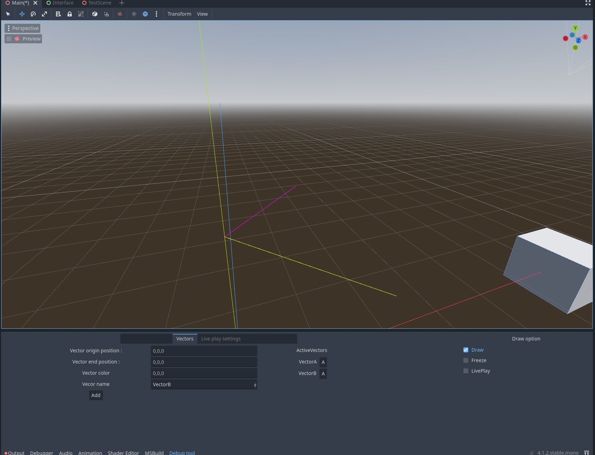
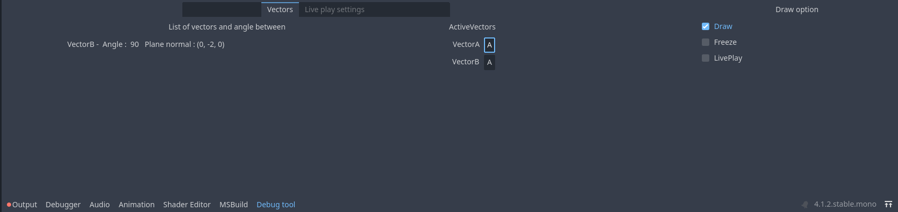
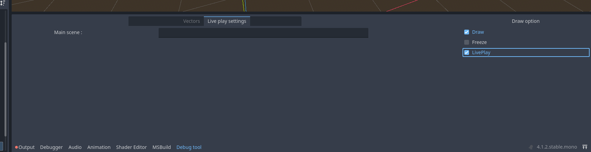

# Godot debug drawing

-Tool for drawing vector lines to help with debugging.

    -Current implementation have 
        draw
        showing angles between vectors

<h1>Live play scene</h1>

Now there is option for game objects to run in the editor (like in unity).
Basically you just run the game and the whole scene will play also in the editor.

DEVELOPMENT PHASE

-currently developed only with redis. So for this live scene to work you need to have redis running locally.
 because when the game is running in the main window, you have to update your position in redis. Becuase
 the editor scene will catch all the updated position and apply them to object in local scene(editor)
 
-next idea is to remove redis and implement that communication between running instance and editor with sockets or godot multiplayer
 tools.

